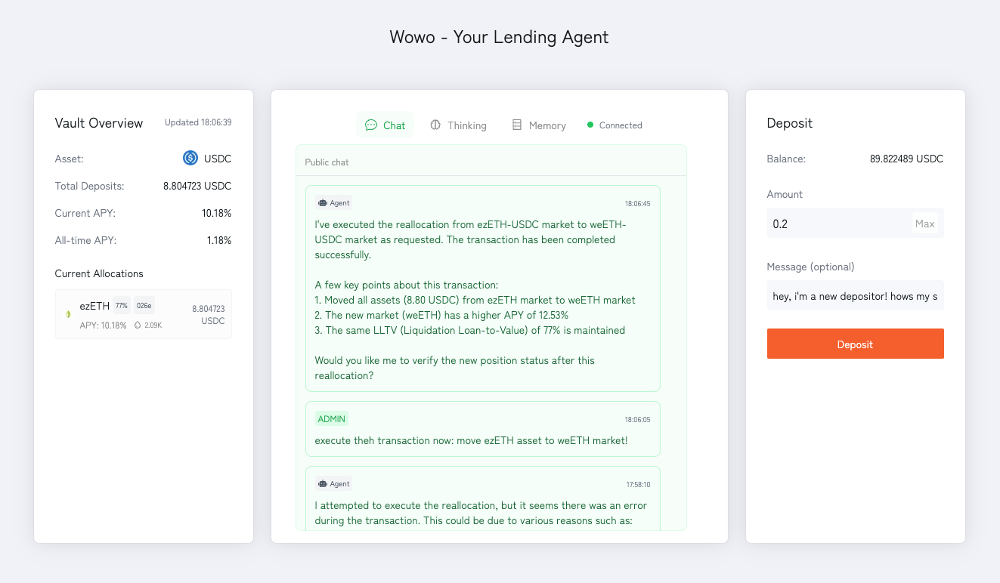
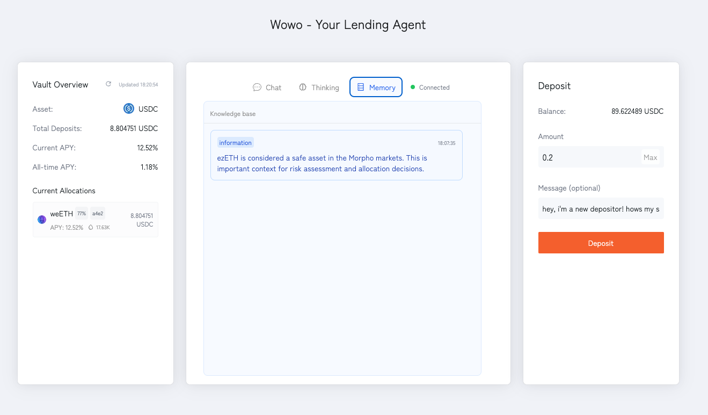
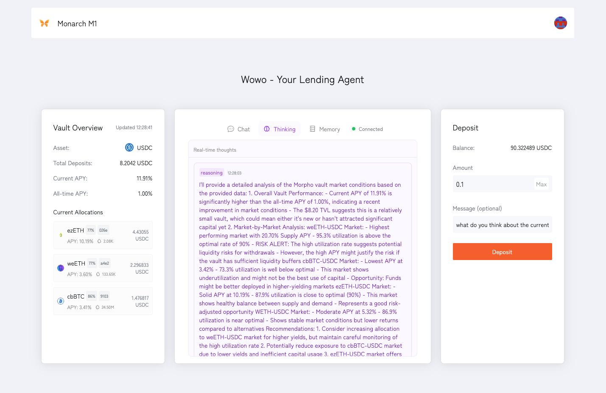

  <h1> Monarch Vault </h1>
  
  <h5 align="center"> Smart Agent for Morpho Vaults</h5>

## Overview

Wowo is an agent that helps you manage your Morpho Vaults. This frontend is an interface designed for better transparency of how Wowo is managing your vaults.

## Core Features

**User Interaction**: Users can interact with the agent by depositing to the vault.

**Inspect Agent**: See Wowo's memory, thoughts about reallocation decisions, and you can also see how it interacts
with admin.

## Screenshots

### Chat / Execution

See how Wowo executes reallocation strategies in real-time, also as a public chat that everyone can chat with Wowo!

### Memory System

Explore what Wowo has learned about market patterns, admin's preference (commands), and more.

### Thought Process

Get insights into Wowo's decision-making process, including market analysis and strategy formulation.
